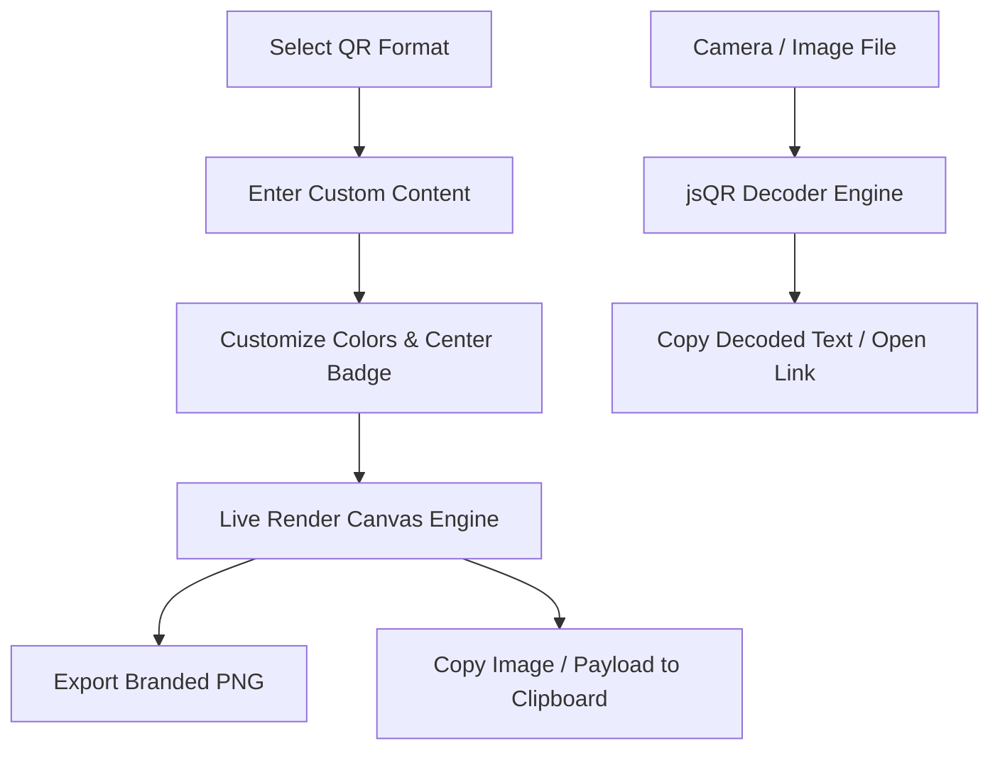

<div align="center">

  

  # ⚡ QR Code Studio Pro
  
  **A luxury, ultra-fast QR Code Generator & Integrated Camera Scanner**  
  *100% Client-Side • Zero Latency • Offline & Private • Dark & Light Theme*

  <p align="center">
    <a href="https://github.com/jatinjangid80/QR-Code-Studio/stargazers"></a>
    <a href="https://github.com/jatinjangid80/QR-Code-Studio/network/members"></a>
    <a href="https://github.com/jatinjangid80/QR-Code-Studio/blob/main/LICENSE"></a>
    
    
  </p>

</div>

---

## 🌟 Highlights

- ⚡ **Zero-Latency Real-Time Generator**: QR codes re-render smoothly with every keystroke.
- 📷 **Integrated Scanner Suite**: Upload any image file or use your webcam/phone camera with live viewfinder.
- 🎨 **Deep Customization**: Foreground/background color pickers, center logos, custom frame captions, resolution scaling (up to 512px Ultra-HD), and Error Correction tuning (L, M, Q, H).
- 🌓 **Dark & Light Mode**: Frosted glassmorphism navigation, dynamic aurora mesh background, and persistent local storage.
- 🛡️ **100% Client-Side Privacy**: Data never touches any external server. Works completely offline.
- 📱 **Fluid Multi-Device Responsive**: Auto-adjusts seamlessly across iPhone, Android, tablets, laptops, and ultra-wide displays.

---

## 🚀 Supported QR Code Types

| Icon | Type | Description |
| :--- | :--- | :--- |
| 🌐 | **Website URL** | Auto-formats protocols (`https://`) for websites and portfolio links. |
| 📶 | **WiFi Network** | Generates standard `WIFI:S:...;` payload with WPA/WPA2/WPA3, WEP, and hidden network support. |
| 🪪 | **vCard Contact** | Complete digital business card (Name, Phone, Email, Company, Job Title, Portfolio). |
| 💸 | **UPI Payment** | Instant Indian UPI payment standard (`upi://pay`) with Payee Name, Amount, and Note. |
| 📝 | **Plain Text** | Universal multi-line text, Unicode, and emoji support with live character counter. |
| ✉️ | **Email (Mailto)** | Pre-composed email with recipient, subject line, and body. |
| 📞 | **Phone / SMS** | Instant phone dialer (`tel:`) or pre-composed text message (`SMSTO:`). |
| 📷 | **QR Scanner** | Decodes QR codes from image files or live camera stream using `jsQR`. |

---

## 🛠️ Tech Stack

- **Markup**: HTML5 Semantic Architecture (Accessible, SEO-optimized)
- **Styling**: Modern CSS3 + TailwindCSS CDN (Custom CSS variables, Glassmorphism, Aurora Gradients)
- **Logic**: Vanilla JavaScript ES6+ (Modular, zero npm bloat)
- **QR Engine**: [qrcodejs](https://github.com/davidshimjs/qrcodejs) (Canvas-based high-res rendering)
- **Scanner Engine**: [jsQR](https://github.com/cozmo/jsQR) (Real-time camera & image decoding)
- **Typography**: Google Fonts (*Outfit* & *JetBrains Mono*)

---

## 🏁 Quickstart Guide

### 1. Clone the repository
```bash
git clone https://github.com/jatinjangid80/QR-Code-Studio.git
cd QR-Code-Studio
```

### 2. Run locally
No installation, npm build, or package manager required! Simply open `index.html` in your browser, or start a lightweight local server:

```bash
# Python 3
python3 -m http.server 8080

# Or Node.js
npx serve .
```

Visit: `http://localhost:8080`

---

## 📁 Repository Structure

```plaintext
QR-Code-Studio/
├── index.html        # Main application layout, navbar, tab forms & footer
├── style.css         # Glassmorphism design tokens, mesh aurora background & responsive CSS
├── script.js         # QR rendering engine, camera scanner, clipboard & theme manager
├── logo.png          # Official brand logo & favicon
└── README.md         # Documentation & guide
```

---

## 💡 How It Works



---

## 👨‍💻 Author

**Designed & Deployed with ❤️ by Jatin Jangid**

- **GitHub**: [@jatinjangid80](https://github.com/jatinjangid80)
- **Project Repository**: [QR-Code-Studio](https://github.com/jatinjangid80/QR-Code-Studio)

---

## 📄 License

This project is licensed under the [MIT License](LICENSE) — free to use for personal and commercial projects.
